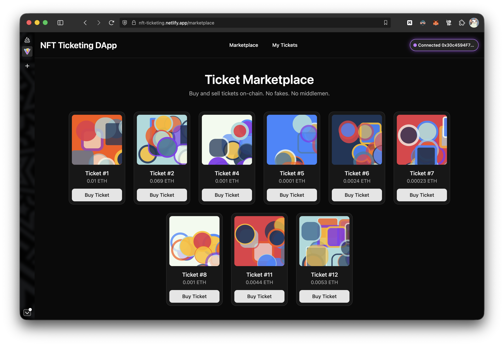

# 🎟️ NFT Ticketing dApp

### [Check it out here!](https://nft-ticketing.netlify.app)



A decentralized ticketing system where users can mint NFTs (ERC-721) and list, buy, and manage tickets through a marketplace smart contract. Built using:

- Hardhat + Ignition (Solidity development & deployment)

- React + Vite + TypeScript (frontend)

- Ethers v6 (smart contract interaction)

Contracts auto-export their ABIs & deployed addresses directly into the frontend via a build script.

## Project Structure

```perl
ticketing-dapp/
│
├── contracts/                 # Solidity contracts
│   ├── TicketNFT.sol
│   └── TicketMarketplace.sol
│
├── ignition/                  # Hardhat Ignition modules
│   └── modules/
│       └── Ticket.ts
│
├── frontend/                  # React + Vite TypeScript app
│   └── src/
│       └── App.tsx            # main app component
│       └── contractConfig.ts  # auto-generated
│
├── scripts/
│   └── write-frontend-config.ts  # generates frontend config
│
├── hardhat.config.ts
├── package.json
└── README.md

```

## Running the app

#### 1. Install blockchain dependencies

```bash
pnpm install
```

#### 2. Install frontend dependencies

```bash
cd frontend
pnpm install
cd ..
```

#### 3. Create the `.env` file

Copy the `.env.example` file to `.env` and fill in the values.

#### 4.1 Deploy on local node

```bash
pnpm hardhat node # Keep running in a separate terminal
pnpm deploy:local
```

You have to add a custom network in your MetaMask to connect to the local node.

```
RPC URL: http://127.0.0.1:8545
Chain ID: 31337
Currency: ETH
```

To access funds in this local testnet, you can use one of the accounts generated by the `pnpm hardhat node` command.

#### 4.2 Sepolia testnet

```bash
pnpm deploy:sepolia
```

Make sure you have a Sepolia wallet with funds and proper credentials and RPC url in your `.env` file.

ABIs and Contract addresses will be auto-generated in the frontend.

#### 5. Start the frontend

```bash
cd frontend
pnpm dev
```
